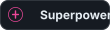
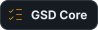

# Hey, I'm Evgeniy (Ap3x0)

**Full-Stack Developer** | **19 y.o.** | **4 years shipping code** | 

Building production web applications, services, and sites from scratch. Telegram Mini Apps with payments, VPN infrastructure & automation with scripts, AI automation & integrations, custom design systems.

[GitHub](https://github.com/Ap3x0s) · [Discord](https://discord.com/users/ap3x0.) · Email: evgenykantor@yandex.ru

## 🛠️ My Stack

  

**Languages:** TypeScript, JavaScript, Python, C#, C++, SQL  
**Frontend:** React 19, Next.js 16, Vite 8, Tailwind CSS 4, Framer Motion  
**Backend:** Node.js (Fastify, Express), FastAPI, Prisma ORM, PostgreSQL, SQLite, Redis, Supabase  
**Real-time:** Socket.io, WebSocket, BullMQ  
**Infrastructure:** Docker, systemd, Railway, Vercel

  
  
  
  
  

---

## 🎯 About Me

I'm a full-stack developer passionate about crafting flawless products that solve real problems. Learning and understanding something new — that's what drives me. Growth isn't optional, it's everything.

I'm genuinely passionate about technology. The entire tech ecosystem fascinates me — from infrastructure and backend systems to sleek, thoughtful design. I love the scale of it all, the complexity, the possibility of creating something that impacts real people. There's something beautiful about automating away the mundane and building systems that just work.

I love the entire journey from idea to production. There's something magical about watching a concept transform into a real, breathing product — the design coming to life, the backend handling real traffic, security and infrastructure working in harmony. I'm fascinated by how all these pieces fit together, and I love being part of that process. It's not just about the work, it's about witnessing the vision become reality.

I genuinely enjoy leading and working alongside talented people. There's a unique energy in being part of a strong team — communicating and collaborating through challenges, working through the tough moments together, building something meaningful as one unit. Great teams elevate everything: code quality, morale, the final product. What matters most is being surrounded by people who genuinely care — not just about the work, but about the craft, about technology itself. Those shared interests, that mutual passion — that's what makes it all matter.

My north star? Becoming a CTO, Security Engineer, or DevSecOps leader — someone who shapes technical vision and keeps systems secure and performant at scale.

Always learning. Always shipping. Always grinding.

## 💬 Languages

Русский (Native) · English (Fluent) · Tech stack speaks for itself

## 🔗 Connect

Open for collaborations, interesting projects, and dev community engagement.

